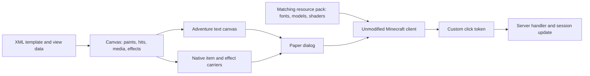

# How dui renders a canvas

This document explains the current **dui 0.2.0-SNAPSHOT / Minecraft 26.2** rendering protocol. Supply it to a coding agent that needs to understand or extend the renderer. For application plugins, use [the public API guide](llm-guide.md) and [quickstart](quickstart.md). The glyph addresses, shader payload and native-widget offsets below are implementation details of this version.

## From template to client



`MenuTemplate` creates a logical `Canvas`. The Paper adapter emits **one** `DialogBody.plainMessage` for its 2D content, followed by native item bodies when needed. A button drawn on the canvas is coloured font geometry with a separate click span. It is not a native dialog button. Native exit buttons and form inputs remain separate Paper dialog elements.

Canvas coordinates start at the top left. Units are Minecraft GUI pixels, before the client's GUI scale turns them into physical pixels. Widths are 120–480; heights are 9–360 and divisible by 9. The text canvas has `height / 9` lines. A newline advances to the next 9-pixel band. The server does not know the client's window size or GUI-scale setting.

## The horizontal pen and negative spacing

Text rendering has a horizontal pen position. Each character has an **advance**, which moves that pen. A bitmap glyph can paint pixels and advance the pen; a `space` provider moves the pen without painting pixels. The resource pack assigns positive and negative advances to private-use Unicode characters.

The following is a subset of the generated `canvas_0.json` space provider:

```json
{
  "type": "space",
  "advances": {
    "\uE800": 1,
    "\uE801": 2,
    "\uE802": 4,
    "\uE803": 8,
    "\uE900": -1,
    "\uE901": -2,
    "\uE902": -4,
    "\uE903": -8
  }
}
```

For bit `b = 0..10`, `U+E800+b` advances by `2^b`; `U+E900+b` advances by `-2^b`. `GlyphFont.shift(n)` decomposes an integer into these powers of two, largest first. It accepts shifts from -2047 to +2047. Zero returns an empty string.

```java
String right13 = GlyphFont.shift(13); // U+E803, U+E802, U+E800: 8 + 4 + 1
String left13 = GlyphFont.shift(-13); // U+E903, U+E902, U+E900: -8 - 4 - 1
```

Those strings only work with the matching font. `CanvasRenderer.shift` emits an Adventure component with font **`dui:canvas_0`**. Placing these characters in a normal vanilla-font string does not provide the same spacing. All nine `dui:canvas_<offset>` fonts contain the space provider, so image runs can also compensate advances locally.

The renderer uses this sequence to place a visual at horizontal coordinate `x`:

```text
shift(+x) -> draw glyphs with total advance A -> shift(-(x + A))
```

Starting at zero, the pen returns to zero: `x + A - (x + A) = 0`. The next element can be positioned independently. Moving the pen back does not erase pixels already drawn. That is how overlapping backgrounds, text and icons can share one text line.

**Visible width and advance are different.** A generated rectangle with visible width 16 has advance 17. At `x=12`, the correct sequence is:

| Operation | Pen before | Pen after |
| --- | ---: | ---: |
| `shift(+12)` | 0 | 12 |
| Draw the 16-pixel rectangle, advance 17 | 12 | 29 |
| `shift(-29)` | 29 | 0 |

Rewinding by only `-28` leaves one pixel of drift. Repeating that mistake shifts subsequent elements and can change wrapping. Use measured font advances, not string length or visible texture width. `GlyphFont` reads the generated pack metrics for text. Do not add bold/italic styling or change a run's font without checking its advances and painted bounds.

## Vertical placement and rectangle glyphs

Negative spacing changes **x**, not y. Vertical placement uses text lines, font ascent and pre-split glyphs.

`GlyphAtlas.rectangle(bit, height)` selects a white bitmap of width `2^bit`, with 1–9 visible rows. Widths range from 1 to 256; their advance is `width + 1`. The codepoint is:

```text
0xEA00 + (height - 1) * 9 + bit
```

The pack contains `dui:canvas_0` through `dui:canvas_8`. A rectangle provider uses ascent `7 - offset`; selecting `canvas_2` places its top two pixels below the current band's top. Adventure's RGB text colour tints the white bitmap. One shared set of white glyphs therefore supplies all panel and button colours.

For each line starting at `rowY`, the renderer intersects a rectangle with `[rowY, rowY+9)`. It draws the intersection using its local offset and height. A tall background becomes multiple horizontal slices; it does not require a new texture.

For example, a rectangle at `(12,11)`, width 13, height 4 is entirely in the band beginning at y=9. Its local offset is 2, so it uses `dui:canvas_2`. Its width is split into 8 + 4 + 1:

| Chunk x | Visible width | Glyph | Advance | Rewind to zero |
| ---: | ---: | --- | ---: | ---: |
| 12 | 8 | `U+EA1E` | 9 | -21 |
| 20 | 4 | `U+EA1D` | 5 | -25 |
| 24 | 1 | `U+EA1B` | 2 | -26 |

Each chunk starts with a shift to its x coordinate, then draws and rewinds. The painted rectangle occupies `[12,25) × [11,15)`.

Text starting exactly on a band uses `dui:text`. For offsets 1–8, `ShiftedText` generates `dui:text_<offset>_0` and `_1`. It splits the original glyph ink into upper and lower 9-pixel bands while preserving each character's advance. The renderer paints those parts on their respective lines. A simple ascent shift would allow ink to cross line boundaries, where the next line's background could cover it. The split avoids that problem.

Consumer glyphs use the same band idea. GlyphSpec defines dimensions and tint policy; the pack assigns addresses and generates offset/band images. Their advance is width+1, maintained by a nearly transparent sizing marker. There is no built-in icon/item sprite registry. Native ItemStacks use the separate model path below.

## Why hit regions are emitted first

Vanilla text hit testing follows the formatted text's advances. It does not reconstruct the final painted outline after all negative rewinds. The renderer relies on the first positive span under the pointer supplying its hover/click style. Decorative glyphs painted later can overlap that position without owning the hit.

Each line is emitted in this order:

1. Walk x from 0 to `canvas.width + 2`. At each position, sample `canvas.at(x, rowY + 4)` and merge consecutive positions with the same hit. Emit an invisible positive-advance span for each segment. Apply that hit's hover event and, when its action is nonempty, its click event.
2. Rewind by `-(canvas.width + 2)` to return to x=0.
3. On the first line, emit the optional focus marker and rewind its advance.
4. Draw background runtime images, then intersecting paints in insertion order, then foreground runtime images, head objects and full-body model bands. Each placement returns the pen to zero. Native item/effect carriers follow the text canvas.
5. Advance to `canvas.width + 2` and append a newline unless this is the last line.

The final positive advance gives the line enough intrinsic width for intermediate glyph positions, including bitmap glyphs' extra pixel. `Dui` supplies a plain-message wrap budget of `canvas.width + 12`, which accounts for the native widget's layout. These constants belong to the pinned 26.2 transport; changing them needs a real-client check.

A hit at `x=24, y=9, width=90, height=18` is repeated on the bands beginning at y=9 and y=18. With a 240-pixel canvas, each affected line has these positive segments before its rewind:

```text
[24 px, no hit] +[90 px, this hit's events] +[128 px, no hit] = 242 px
then shift(-242), paint the visuals, and finish with shift(+242)
```

The hit's y and height must be multiples of 9. Painting can use sub-row offsets; interaction remains on the row grid. `Canvas.at` searches hits in reverse insertion order, so later hits win where regions overlap. The component's drawn shape and its rectangular hit geometry are independent; keep them aligned in layout code.

Custom click events carry a random token, not raw mouse coordinates. `Dui` binds that token to the hit, player, session and revision. The handler receives the bound `Canvas.Hit` and its id/action/value through `ActionContext`. Accepted tokens invalidate all callbacks of that player's displayed revision. Re-render an interactive session after an action to issue fresh tokens. HTTP(S) links use native URL confirmation instead of this server callback path.

## Runtime images, portraits and real items

**Images and QR codes** are server-supplied `RasterImage` values. The renderer samples them into 1–8-pixel cells, merges same-colour horizontal runs and paints RGB-tinted rectangle glyphs. Each rectangle's extra advance is cancelled with `shift(-1)`; the row then rewinds its full width. Background images draw before ordinary paints; foreground images draw after them. Set `background="none"` on a menu with a full-surface background image, or its root rectangle will cover that image. Place labels outside foreground image bounds. The component transmits colour/geometry; the thumbnail is not added to the pack and the client does not fetch its image URL. There is a 16,384-sampled-pixel budget per canvas.

**Player portraits** use native Adventure player-head object components, positioned with `shift(x)` and rewound by `-(x+8)`. Minecraft renders the profile/skin; dui does not generate a skin image in the pack. A large 3D head uses a native ItemStack instead.

**Real items** use native item bodies following the text canvas. `ShaderItems` clones the supplied ItemStack and selects a generated wrapper under `dui:live/<original_namespace>/<original_key>`. The wrapper combines its original model definition with a small colour-coded transport frame. Minecraft renders that model into its oversized GUI render target. Shared `position_tex_color` shaders recognize the frame's signature, crop its central 36×36 native render from the 48×48 logical frame, and reposition/scale the result onto the canvas. The generator creates model wrappers, not pre-rendered PNGs of every item.

Placement data is encoded in CustomModelData colour entries beginning at index 32. Each RGB cell carries three bits, using channel values 0 or 255; ten cells carry the base 30-bit payload:

| Bits | Meaning |
| --- | --- |
| 0–10 | `dx + 1024` |
| 11–21 | `dy + 1024` |
| 22–28 | Native item size, or effect-carrier flags |
| 29 | Additional motion/shader/clip data is present |

The consumer-facing item rectangle stays in canvas coordinates. For item index `i` starting at zero, the adapter currently encodes `dx = item.x - canvas.width/2` and `dy = item.y - canvas.height - 14 - (i+1)*11`. These offsets compensate the native bodies' position, padding and gaps. Reserve CustomModelData colour entries 32 and above for this transport; earlier entries are retained. A transparent layer-fence body is inserted before the item bodies because vanilla orders GUI draws using their original bounds, before the shader relocates them.

Moving a visible native item does not move its vanilla widget's hit area. The text canvas still owns interaction. A direct `dui-item` is visual only; compose a consumer slot component or a separate hitbox when an item needs clicks. Shader effects also use a shared carrier with encoded bounds and typed parameters. They animate from client `GameTime` and the supplied world-tick start; frame-by-frame packets and menu-specific shader files are unnecessary. The server remains responsible for game results, balances and timing rules.

## Focus outline and pack dependencies

`focus-outline` defaults to native. With hidden, the caller supplies a mask color (or explicit solid background). A supplementary-PUA glyph encodes the declared canvas size in its texture corners. The text shader expands it only over the native padded stroke, keeping runtime vertex RGB; its nine-unit advance is rewound. The technical padding is pinned to the native widget, while RGB is caller-owned. This cover does not transparently erase every Minecraft border. Core shaders contain no menu palette.

Fonts supply horizontal advances, vertical slices and raster primitives. Item wrappers and shared shaders supply native model placement, effects and the focus mask. Applications share this pack and change their templates/data; they do not generate a custom font or shader for each dialog. New pack assets or transport changes require regenerating the ZIP and deploying its matching `dui.json`, which supplies its hash, font advances and model registry.

## Where to inspect and debug

| Implementation | Responsibility |
| --- | --- |
| [GlyphFont](../dui-core/src/main/java/gg/kembel/dui/core/GlyphFont.java) / [GlyphAtlas](../dui-core/src/main/java/gg/kembel/dui/core/GlyphAtlas.java) | Spacing encoding, text metrics and rectangle/icon addresses |
| [CanvasPack](../dui-pack/src/main/java/gg/kembel/dui/pack/CanvasPack.java) / [ShiftedText](../dui-pack/src/main/java/gg/kembel/dui/pack/ShiftedText.java) | Font providers, ascent variants and glyph band splitting |
| [CanvasRenderer](../dui-paper/src/main/java/gg/kembel/dui/paper/CanvasRenderer.java) | Hit-first lines, pen rewinds, paint order and runtime images |
| [ShaderItems](../dui-paper/src/main/java/gg/kembel/dui/paper/ShaderItems.java) / [ItemTransport](../dui-core/src/main/java/gg/kembel/dui/core/ItemTransport.java) | Native bodies and binary placement/effect data |
| [ShaderItemPack](../dui-pack/src/main/java/gg/kembel/dui/pack/ShaderItemPack.java) / [shared shaders](../dui-pack/src/main/resources/ui/shader) | Model wrappers, transport detection and GPU drawing |
| [Dui](../dui-paper/src/main/java/gg/kembel/dui/paper/Dui.java) / [CallbackRegistry](../dui-core/src/main/java/gg/kembel/dui/core/CallbackRegistry.java) | Pack/session lifecycle and action capabilities |

If rendering drifts horizontally, trace the pen and check every glyph's measured advance and compensating rewind. If text loses pixels between lines, inspect its offset/band selection. If clicks differ from the visible control, inspect hit order, 9-pixel alignment and positive spans. Missing glyphs usually require checking the selected font and matching pack; misplaced items require checking native-body offsets and transport recognition. Validate renderer/pack changes with dui-demo's real-client coordinate and screenshot scenarios, including Compact/Spacious layouts and runtime images. A unit test cannot verify vanilla's actual line wrapping, draw ordering or shader execution.

For an LLM task, supply this file together with the LLM guide and the relevant source files from the table. Ask it to preserve the pen-reset invariant, hit-first ordering, band clipping and pack/runtime agreement rather than inventing CSS positioning or a browser renderer.

## Version-four typed shader ABI

`protocol/renderer.json` generates the Java/GLSL constants. Renderer version 4 and its SHA-256 must match metadata. Old effect/preset ordinal paths are removed. Technical native placement signatures/body offsets remain part of the pinned platform backend.

The extended header has start (15 bits), canvas width/height (9 each), origin x/y (9 each), mode (3 bits). Procedural modes are untracked 1 and tracked 6. Modes 4/5 carry generic native motion, with 5 including a fixed viewport. All share the existing three-bits-per-RGB-cell transport in CustomModelData colors from index 32 onward.

Each shader invocation has six-bit pack-assigned code, x/y/width/height (nine bits each), then ordered typed fields from ShaderSpec. A scalar uses at most 30 bits; total schema <=240. The generated decoder uses a cross-word reader, so fields may span 30-bit uint words. No schema is restricted to the former two 15-bit demo parameters. Hashes cover ordered names, kinds, bounds, steps and enum choices.

A tracked invocation adds the 99-bit motion payload. EffectBatches measures actual cost, preserves insertion order and separates tracked/untracked calls; a carrier holds <=576 bits and <=8 calls. Eight calls per canvas is the default logical budget; explicit budgets may reach 32. A larger schema can therefore require more carriers. RenderReport exposes actual carrier/body cost.

Generated functions receive local q, size, typed p, age-seconds t and live. They return straight-alpha RGBA. Generic motion inversely transforms q and multiplies opacity; composition preserves alpha. Consumers own visual policies and finite lifetimes. Shared helper modules are trusted build inputs emitted before functions. See extensions.md for a complete independent schema/code example.

## Generic finite motion and clipping

Motion has startedAt/duration/delay/easing/enabled, signed translation, scale/rotation/opacity endpoints and pivot. Duration/delay 1..127/0..127 ticks; translation/rotation -256..255; scale 0..255/64 with 1/64 encoding; opacity/pivot 0..1 with 1/255 encoding. Easing is linear/ease-out/ease-in-out/back-out. No pop/bounce/lift design is built into the transport.

The shader uses world-time modulo 24000; finish/remove transient events before wrap and use a world-tick start, not wall time. Motion-off chooses final generic poses and calls contributed visuals with live=false. Native clips are fixed canvas-space viewports applied after transforms. Hits remain at application destination geometry.

Scene planning suppresses whole intersecting earlier late-backend objects under dropdown coverage without mutating the source. It does not provide arbitrary cross-backend painter ordering. Runtime images can be background/foreground rasters. ARGB rasters preserve alpha using 15 nonzero alpha levels; callers may instead explicitly flatten onto their surface color. SceneGroup samples a common transform for supported visual backends and grid-aligned hits; standalone GPU Motion still leaves hits at application destination geometry.

Component serialization bytes omit native ItemStack payloads and network framing. DialogSession.renderNanos measures server adapter construction, not latency/GPU work. FPS samples in capped local clients are separate diagnostics, not a throughput promise. Validate actual glyph advances, click coordinates, shader output, still-mode stability and native resource preservation through real-client tests.

See [dynamic composition](dynamic-composition.md) for measured/typed components, shared group geometry, RGBA/fonts, keyframes, runtime map layers, registered model cameras and trusted Paper backend extensions. Renderer/world-map protocol 4 packs must be rebuilt together with metadata.
