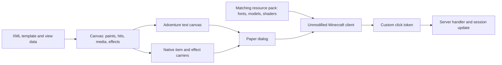

> This document includes the retained legacy wire paths. The current generated transport is protocol 2; read the versioned section below before changing fields. Application developers should use [public APIs](application-api.md), not encode these payloads themselves.

# How dui renders a canvas

This document explains the current **dui 0.1.0-SNAPSHOT / Minecraft 26.2** rendering protocol. Supply it to a coding agent that needs to understand or extend the renderer. For application plugins, use [the public API guide](llm-guide.md) and [quickstart](quickstart.md). The glyph addresses, shader payload and native-widget offsets below are implementation details of this version.

## From template to client



`MenuTemplate` creates a logical `Canvas`. The Paper adapter emits **one** `DialogBody.plainMessage` for its 2D content, followed by native item bodies when needed. A button drawn on the canvas is coloured font geometry with a separate click span. It is not a native dialog button. Native exit buttons and form inputs remain separate Paper dialog elements.

Canvas coordinates start at the top left. Units are Minecraft GUI pixels, before the client's GUI scale turns them into physical pixels. Widths are 120–480; heights are 9–360 and divisible by 9. The text canvas has `height / 9` lines. A newline advances to the next 9-pixel band. The server does not know the client's window size or GUI-scale setting.

## The horizontal pen and negative spacing

Text rendering has a horizontal pen position. Each character has an **advance**, which moves that pen. A bitmap glyph can paint pixels and advance the pen; a `space` provider moves the pen without painting pixels. The resource pack assigns positive and negative advances to private-use Unicode characters.

The following is a subset of the generated `canvas_0.json` space provider:

```json
{
  "type": "space",
  "advances": {
    "\uE800": 1,
    "\uE801": 2,
    "\uE802": 4,
    "\uE803": 8,
    "\uE900": -1,
    "\uE901": -2,
    "\uE902": -4,
    "\uE903": -8
  }
}
```

For bit `b = 0..10`, `U+E800+b` advances by `2^b`; `U+E900+b` advances by `-2^b`. `GlyphFont.shift(n)` decomposes an integer into these powers of two, largest first. It accepts shifts from -2047 to +2047. Zero returns an empty string.

```java
String right13 = GlyphFont.shift(13); // U+E803, U+E802, U+E800: 8 + 4 + 1
String left13 = GlyphFont.shift(-13); // U+E903, U+E902, U+E900: -8 - 4 - 1
```

Those strings only work with the matching font. `CanvasRenderer.shift` emits an Adventure component with font **`dui:canvas_0`**. Placing these characters in a normal vanilla-font string does not provide the same spacing. All nine `dui:canvas_<offset>` fonts contain the space provider, so image runs can also compensate advances locally.

The renderer uses this sequence to place a visual at horizontal coordinate `x`:

```text
shift(+x) -> draw glyphs with total advance A -> shift(-(x + A))
```

Starting at zero, the pen returns to zero: `x + A - (x + A) = 0`. The next element can be positioned independently. Moving the pen back does not erase pixels already drawn. That is how overlapping backgrounds, text and icons can share one text line.

**Visible width and advance are different.** A generated rectangle with visible width 16 has advance 17. At `x=12`, the correct sequence is:

| Operation | Pen before | Pen after |
| --- | ---: | ---: |
| `shift(+12)` | 0 | 12 |
| Draw the 16-pixel rectangle, advance 17 | 12 | 29 |
| `shift(-29)` | 29 | 0 |

Rewinding by only `-28` leaves one pixel of drift. Repeating that mistake shifts subsequent elements and can change wrapping. Use measured font advances, not string length or visible texture width. `GlyphFont` reads the generated pack metrics for text. Do not add bold/italic styling or change a run's font without checking its advances and painted bounds.

## Vertical placement and rectangle glyphs

Negative spacing changes **x**, not y. Vertical placement uses text lines, font ascent and pre-split glyphs.

`GlyphAtlas.rectangle(bit, height)` selects a white bitmap of width `2^bit`, with 1–9 visible rows. Widths range from 1 to 256; their advance is `width + 1`. The codepoint is:

```text
0xEA00 + (height - 1) * 9 + bit
```

The pack contains `dui:canvas_0` through `dui:canvas_8`. A rectangle provider uses ascent `7 - offset`; selecting `canvas_2` places its top two pixels below the current band's top. Adventure's RGB text colour tints the white bitmap. One shared set of white glyphs therefore supplies all panel and button colours.

For each line starting at `rowY`, the renderer intersects a rectangle with `[rowY, rowY+9)`. It draws the intersection using its local offset and height. A tall background becomes multiple horizontal slices; it does not require a new texture.

For example, a rectangle at `(12,11)`, width 13, height 4 is entirely in the band beginning at y=9. Its local offset is 2, so it uses `dui:canvas_2`. Its width is split into 8 + 4 + 1:

| Chunk x | Visible width | Glyph | Advance | Rewind to zero |
| ---: | ---: | --- | ---: | ---: |
| 12 | 8 | `U+EA1E` | 9 | -21 |
| 20 | 4 | `U+EA1D` | 5 | -25 |
| 24 | 1 | `U+EA1B` | 2 | -26 |

Each chunk starts with a shift to its x coordinate, then draws and rewinds. The painted rectangle occupies `[12,25) × [11,15)`.

Text starting exactly on a band uses `dui:text`. For offsets 1–8, `ShiftedText` generates `dui:text_<offset>_0` and `_1`. It splits the original glyph ink into upper and lower 9-pixel bands while preserving each character's advance. The renderer paints those parts on their respective lines. A simple ascent shift would allow ink to cross line boundaries, where the next line's background could cover it. The split avoids that problem.

Small built-in icons use a similar band split and a fixed advance of 10. The optional `icon="item/..."` font path uses a finite registry of vanilla texture references with measured advances for two halves. It is separate from the real native ItemStack path described below.

## Why hit regions are emitted first

Vanilla text hit testing follows the formatted text's advances. It does not reconstruct the final painted outline after all negative rewinds. The renderer relies on the first positive span under the pointer supplying its hover/click style. Decorative glyphs painted later can overlap that position without owning the hit.

Each line is emitted in this order:

1. Walk x from 0 to `canvas.width + 2`. At each position, sample `canvas.at(x, rowY + 4)` and merge consecutive positions with the same hit. Emit an invisible positive-advance span for each segment. Apply that hit's hover event and, when its action is nonempty, its click event.
2. Rewind by `-(canvas.width + 2)` to return to x=0.
3. On the first line, emit the optional focus marker and rewind its advance.
4. Draw intersecting paints in insertion order, then runtime image cells, then head objects. Each placement returns the pen to zero.
5. Advance to `canvas.width + 2` and append a newline unless this is the last line.

The final positive advance gives the line enough intrinsic width for intermediate glyph positions, including bitmap glyphs' extra pixel. `Dui` supplies a plain-message wrap budget of `canvas.width + 12`, which accounts for the native widget's layout. These constants belong to the pinned 26.2 transport; changing them needs a real-client check.

A hit at `x=24, y=9, width=90, height=18` is repeated on the bands beginning at y=9 and y=18. With a 240-pixel canvas, each affected line has these positive segments before its rewind:

```text
[24 px, no hit] +[90 px, this hit's events] +[128 px, no hit] = 242 px
then shift(-242), paint the visuals, and finish with shift(+242)
```

The hit's y and height must be multiples of 9. Painting can use sub-row offsets; interaction remains on the row grid. `Canvas.at` searches hits in reverse insertion order, so later hits win where regions overlap. The component's drawn shape and its rectangular hit geometry are independent; keep them aligned in layout code.

Custom click events carry a random token, not raw mouse coordinates. `Dui` binds that token to the hit, player, session and revision. The handler receives the bound `Canvas.Hit` and its id/action/value through `ActionContext`. Accepted tokens invalidate all callbacks of that player's displayed revision. Re-render an interactive session after an action to issue fresh tokens. HTTP(S) links use native URL confirmation instead of this server callback path.

## Runtime images, portraits and real items

**Images and QR codes** are server-supplied `RasterImage` values. The renderer samples them into 1–8-pixel cells, merges same-colour horizontal runs and paints RGB-tinted rectangle glyphs. Each rectangle's extra advance is cancelled with `shift(-1)`; the row then rewinds its full width. Image runs draw after ordinary paints, so put labels outside their bounds. The component transmits colour/geometry; the thumbnail is not added to the pack and the client does not fetch its image URL. There is a 16,384-sampled-pixel budget per canvas.

**Player portraits** use native Adventure player-head object components, positioned with `shift(x)` and rewound by `-(x+8)`. Minecraft renders the profile/skin; dui does not generate a skin image in the pack. A large 3D head uses a native ItemStack instead.

**Real items** use native item bodies following the text canvas. `ShaderItems` clones the supplied ItemStack and selects a generated wrapper under `dui:live/<original_namespace>/<original_key>`. The wrapper combines its original model definition with a small colour-coded transport frame. Minecraft renders that model into its oversized GUI render target. Shared `position_tex_color` shaders recognize the frame's signature, crop its central 36×36 native render from the 48×48 logical frame, and reposition/scale the result onto the canvas. The generator creates model wrappers, not pre-rendered PNGs of every item.

Placement data is encoded in CustomModelData colour entries beginning at index 32. Each RGB cell carries three bits, using channel values 0 or 255; ten cells carry the base 30-bit payload:

| Bits | Meaning |
| --- | --- |
| 0–10 | `dx + 1024` |
| 11–21 | `dy + 1024` |
| 22–28 | Native item size, or effect-carrier flags |
| 29 | Additional confetti/effect/transition data is present |

The consumer-facing item rectangle stays in canvas coordinates. For item index `i` starting at zero, the adapter currently encodes `dx = item.x - canvas.width/2` and `dy = item.y - canvas.height - 14 - (i+1)*11`. These offsets compensate the native bodies' position, padding and gaps. Reserve CustomModelData colour entries 32 and above for this transport; earlier entries are retained. A transparent layer-fence body is inserted before the item bodies because vanilla orders GUI draws using their original bounds, before the shader relocates them.

Moving a visible native item does not move its vanilla widget's hit area. The text canvas still owns interaction. A direct `dui-item` is visual only; use an actionable `dui-slot` or a separate canvas control hit when an item needs clicks. Shader effects also use a shared carrier with encoded bounds and typed parameters. They animate from client `GameTime` and the supplied world-tick start; frame-by-frame packets and menu-specific shader files are unnecessary. The server remains responsible for game results, balances and timing rules.

## Focus outline and pack dependencies

The first line's `U+ECF0` glyph uses `dui:focus_guard`. Its colour carries `width | (height << 9)`; its 9-pixel advance is immediately rewound. The text shader recognizes its tagged pixels and expands that glyph into a padded perimeter mask. It paints the outer stroke in the fixed colour `#16171D` and discards the centre. This masks dui's native focus border; it does not globally remove all Minecraft widget borders. `focus-outline="native"` omits the marker.

Fonts supply horizontal advances, vertical slices and raster primitives. Item wrappers and shared shaders supply native model placement, effects and the focus mask. Applications share this pack and change their templates/data; they do not generate a custom font or shader for each dialog. New pack assets or transport changes require regenerating the ZIP and deploying its matching `dui.json`, which supplies its hash, font advances and model registry.

## Where to inspect and debug

| Implementation | Responsibility |
| --- | --- |
| [GlyphFont](../dui-core/src/main/java/gg/kembel/dui/core/GlyphFont.java) / [GlyphAtlas](../dui-core/src/main/java/gg/kembel/dui/core/GlyphAtlas.java) | Spacing encoding, text metrics and rectangle/icon addresses |
| [CanvasPack](../dui-pack/src/main/java/gg/kembel/dui/pack/CanvasPack.java) / [ShiftedText](../dui-pack/src/main/java/gg/kembel/dui/pack/ShiftedText.java) | Font providers, ascent variants and glyph band splitting |
| [CanvasRenderer](../dui-paper/src/main/java/gg/kembel/dui/paper/CanvasRenderer.java) | Hit-first lines, pen rewinds, paint order and runtime images |
| [ShaderItems](../dui-paper/src/main/java/gg/kembel/dui/paper/ShaderItems.java) / [ItemTransport](../dui-core/src/main/java/gg/kembel/dui/core/ItemTransport.java) | Native bodies and binary placement/effect data |
| [ShaderItemPack](../dui-pack/src/main/java/gg/kembel/dui/pack/ShaderItemPack.java) / [shared shaders](../dui-pack/src/main/resources/ui/shader) | Model wrappers, transport detection and GPU drawing |
| [Dui](../dui-paper/src/main/java/gg/kembel/dui/paper/Dui.java) / [CallbackRegistry](../dui-core/src/main/java/gg/kembel/dui/core/CallbackRegistry.java) | Pack/session lifecycle and action capabilities |

If rendering drifts horizontally, trace the pen and check every glyph's measured advance and compensating rewind. If text loses pixels between lines, inspect its offset/band selection. If clicks differ from the visible control, inspect hit order, 9-pixel alignment and positive spans. Missing glyphs usually require checking the selected font and matching pack; misplaced items require checking native-body offsets and transport recognition. Validate renderer/pack changes with dui-demo's real-client coordinate and screenshot scenarios, including Compact/Spacious layouts and runtime images. A unit test cannot verify vanilla's actual line wrapping, draw ordering or shader execution.

For an LLM task, supply this file together with the LLM guide and the relevant source files from the table. Ask it to preserve the pen-reset invariant, hit-first ordering, band clipping and pack/runtime agreement rather than inventing CSS positioning or a browser renderer.

## Native transition transport

The extended 18-cell header has start tick (15 bits), canvas width/height (9 each), origin x/y (9 each) and transport kind (3 bits). Kind 0 is legacy native confetti, 1 is the shared effect panel, 2 transforms a native quad and 3 adds a fixed viewport to that native quad. Native paths retain their normal texture crop. Off-canvas clipped native origins are clamped in the legacy header's informational origin fields; their actual placement still comes from the base offsets.

Kinds 2/3 read six left-edge RGB cells, outside the native crop. Their 18 bits encode duration (0–6), preset ordinal `POP=0`, `BOUNCE=1`, `LIFT=2`, `SLIDE=3` (7–8), distance magnitude (9–15), motion flag (16), and negative-distance flag (17). SLIDE eases from `finalX + signedDistance` to `finalX` without scaling or rotating.

Kind 3 reads thirteen right-edge cells (38 data bits): clip X minus final item X +512 (0–9), clip Y minus final item Y +512 (10–19), width (20–28), height (29–37). The vertex stage supplies interpolated GUI coordinates after transformation and the fixed viewport; the fragment stage discards native pixels outside it. This works for static clipped items as well: the adapter supplies a motion-disabled zero-distance SLIDE when no transition is requested. Hits are unaffected. Clipped items must use a separate carrier for confetti/shared effects.

Native model wrappers supply **47 custom colour cells**, replacing the previous 34; regenerate the pack together with the adapter. The shared panel's component stream still starts at payload index 28; the new edge cells do not shift its existing encoding. CustomModelData indices 32 and higher remain reserved.

Each transition reads client game time independently. It scales, rotates and translates the already-rendered original model; it does not replace the item with a PNG. The shared panel's component kinds are reel 1, lever 2, coins 3, lights 4 and confetti 5. Confetti shares the bounded count/origin/even-delay parameters with coins, using a 72-tick burst lifetime after delay.

The transported clock wraps every 24,000 world ticks. A consumer must finish transient events before that wrap: remove the effect or render its final pose with motion false after the event, guard any scheduled completion with the active session and a generation token, and cancel on explicit close. Preserve start ticks through unrelated updates. The Advent demo demonstrates this with one reveal update and one finite-effect cleanup, never a per-frame packet loop.

## Runtime image layering and procedural cards

`Canvas.Image.background()` defaults to false, including the previous seven-argument constructor. `canvas.image(..., raster, true)` or `image-layer="background"` emits RGB glyphs before normal paints; foreground rasters emit afterwards. Both retain the same centre crop and 16,384-sample budget. This lets a consumer overlay labels and controls on its own illustration without a per-menu resource-pack asset.

The shared effect transport also contains `PLAYING_CARD=6` and `CHIP_STACK=7`. The unchanged component layout is kind3/x9/y9/width9/height9/parameter0_15/parameter1_15 (69 bits, 23 RGB cells). Card parameter0: value bits0–5 (63 means unknown), faceDown bit6, active bit7, even-delay/2 bits8–12, animation bits13–14 (static0/deal1/flip2/fly3). Parameter1: duration bits0–6, lift (or fly card-height) bits7–12, back palette bits13–14. Chip parameter0: count bits0–4, palette bits5–6, source anchor bits7–9, destination bits10–12. Parameter1: duration bits0–6, mode bits7–8 (static0/transfer1), even-delay/2 bits9–14. Anchor codes are top-left0/top-right1/bottom-left2/bottom-right3/top4/bottom5/left6/right7. Cards/chips are procedural GLSL; there is no atlas of 52 pre-rendered faces. Source lives in `dui-pack/src/main/resources/ui/shader/effects.glsl`.

## Single-zero wheel preset and invisible hits

`ShaderEffect.Kind.WHEEL` uses previously unused **type code 0**. Existing type codes 1–7 and the 69-bit/23-cell per-effect transport stay unchanged. Rebuild the matching shared shader pack: an older pack cannot render the new kind. Do not rely on enum ordinals; the wire value is `kind.code`.

- Parameter 0: target number bits 0–5, previous number bits 6–11, rotor turns bits 12–14. Numbers must be 0–36; turns 1–7.
- Parameter 1: duration ticks bits 0–8 (20–511), spin bit 9 (static 0/spin 1), material bit 10 (walnut 0/ebony 1). Remaining bits are reserved.
- Animated lifetime is the duration when spin is set; a static wheel has lifetime zero. The root world-tick start drives continuous shader time; there is no per-frame server update.

The preset uses the clockwise single-zero sequence `0,32,15,19,4,21,2,25,17,34,6,27,13,36,11,30,8,23,10,5,24,16,33,1,20,14,31,9,22,18,29,7,28,12,35,3,26`. Continuous rotor easing and a counter-rotating ball settle into the supplied target beneath the fixed marker. The final stage follows the rotor with a damped bounce. Radial wedges, inset pockets, ivory ball, walnut/ebony surfaces, brass rings and numerals are procedural GLSL; there is no sprite sheet or roulette background texture in the pack. The animation presents a server-selected result; it does not simulate randomness or real-world ball physics.

`dui-hitbox` adds only a `Canvas.Hit`. It emits no paint, runtime raster or native item. It is useful for composing a small illustrated grid without inheriting button padding or appearance. Hit bounds still use full 9-pixel rows because vanilla text callbacks operate at that granularity. Add the hit after the corresponding decoration and give it an explicit unique ID; do not promise arbitrary vertical mouse coordinates or dragging.

## Versioned protocol 2

`protocol/renderer.json` is the source of generated Java RendererProtocol and shader protocol.glsl constants, including the schema hash. `python3 scripts/generate-protocol.py --check` verifies both outputs. Library version, Minecraft version, wire protocol and declared capabilities are separate fields; exact ZIP identity remains enforced. See [compatibility](compatibility.md).

The three-bit carrier header retains legacy kinds 0..3. Kinds 4/5 are generic native motion without/with clipping; 6 carries four-bit extended effect kinds; 7 carries extended effects with generic tracks. Built-in effect codes 0..7 retain their meaning; codes 8..15 are trusted contributed effects. An unknown code/capability fails metadata validation rather than being truncated into a legacy field.

The native model's centre crop remains 36 pixels inside its 48-pixel frame. Forty-eight additional RGB perimeter cells carry generic Motion fields; the original 47-cell path remains available. A colour cell carries three threshold-decoded bits. The generic tracks are finite translation, scale, rotation, opacity, pivot, duration, delay and easing. Outer guards and signed offsets are generated/validated together with the shader.

Effects split into bounded native bodies: eight ordinary effects per carrier, two tracked effects per carrier. Extended effects use 24 cells; tracked effects add 48 motion cells per record. Body placement accounts for each actual vanilla body, including extra batch carriers. Default total budget remains eight; larger explicit budgets require effects-32. Do not assume one carrier means any number of objects.

The GPU transforms the actual native model or procedural primitive; items are not rasterized into an exhaustive sprite pack. Preset paths retain detailed card flips/flights, staggered chips and wheel/ball behaviour. Generic tracks can move unrelated native models and procedural cards without a menu-specific shader. Clock age is world tick modulo 24,000; finish/remove transients before a wrap. Motion-off uses final poses and is verified through zero screenshot deltas.

Scene planning handles dropdown coverage before backend emission. It suppresses intersecting earlier late-backend objects completely while preserving the source scene. This is not arbitrary cross-backend painter ordering or pixel-accurate popup clipping. Native ItemClip remains a fixed viewport applied after transformation; click rectangles remain application destination geometry.

PackContribution supplies owned resources plus named GLSL functions with IDs/codes validated for collisions. The generator inserts trusted build-time functions into the shared shader and emits manifest capabilities. The demo's pulse function proves this path in an actual client; runtime template code injection is not supported.

RenderReport counts are capacity diagnostics. Exported component serialization bytes omit native ItemStack payloads and packet framing. DialogSession.renderNanos measures the adapter's component/native/dialog construction on the server, not network transit or GPU time. Client FPS is sampled separately; the local tests are capped and do not establish a maximum safe production budget.
